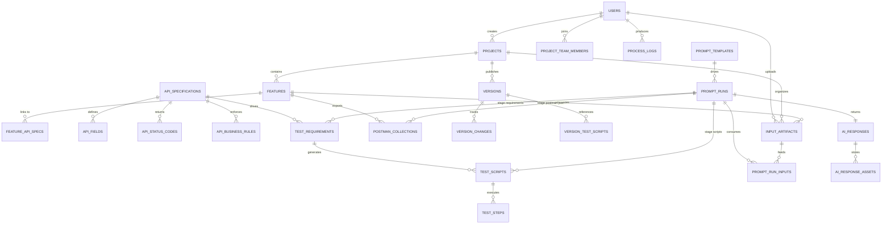

# API Testing Automation Workflow - Database Schema

## Overview
- Target database: PostgreSQL 15+ (JSONB + arrays leveraged for flexible payloads, artifacts, and AI metadata).
- Goal: persist users, collaborative projects, API specifications, generated requirements/scripts, version history, prompt templates, uploaded artifacts (text, files, images), and AI responses for the automation workflow.
- Naming uses `snake_case`; timestamps use `timestamptz` with `DEFAULT CURRENT_TIMESTAMP` unless noted. Soft deletes rely on status columns.
- The schema mirrors the six-step AI journey: **(1) collect input data artifacts -> (2) Continue #1 prompts the Test List Requirement -> (3) users review/update requirements -> (4) Continue #2 prompts detailed scripts -> (5) users inspect script details -> (6) Continue #3 prompts JSON/Postman exports**.

## Guided Workflow Steps
| Step | Description | Prompt Stage | Primary Tables |
| --- | --- | --- | --- |
| 1. Input Data Artifact | User uploads text, images, PDFs, txt, or prompt templates as artifacts. | _n/a_ | `input_artifacts`, `projects`, `features` |
| 2. Continue (first click) | Prompt run creates a **Test List Requirement** with scenarios + preliminary cases. | `requirements` | `prompt_runs`, `prompt_run_inputs`, `test_requirements`, `ai_responses` |
| 3. Show Test List Requirement | User reviews/edits requirements prior to script generation. | review | `test_requirements`, `ai_response_assets` |
| 4. Continue (second click) | Prompt run transforms each requirement into detailed scripts + steps. | `scripts` | `prompt_runs`, `test_scripts`, `test_steps`, `ai_responses` |
| 5. Show script details | User inspects generated script code and metadata. | review | `test_scripts`, `test_steps` |
| 6. Continue (third click) -> Export JSON | Prompt run aggregates scripts into Postman-ready JSON bundles for import. | `postman-json` | `prompt_runs`, `postman_collections`, `postman_requests`, `ai_response_assets` |

## Entity Relationship Summary

## Table Definitions

### `users`
| Column | Type | Constraints | Description |
| --- | --- | --- | --- |
| `id` | uuid | PK | Primary identifier shared across auth and profile contexts. |
| `name` | text | NOT NULL | Display name shown in UI. |
| `email` | citext | NOT NULL, UNIQUE | Login and notification address. |
| `role` | text | NOT NULL CHECK (`role` IN ('QC','BA','Developer')) | Primary job function. |
| `avatar_url` | text | NULL | Optional profile image. |
| `password_hash` | text | NOT NULL | Argon2/bcrypt hash for sign-in. |
| `created_at` | timestamptz | NOT NULL DEFAULT now() | Account creation time. |
| `last_login_at` | timestamptz | NULL | Mirrors `AuthUser.lastLogin`. |

Indexes: unique index on `email`; optional partial index on `(role)` for filtering.

### `projects`
| Column | Type | Constraints | Description |
| --- | --- | --- | --- |
| `id` | uuid | PK | Project identifier. |
| `name` | text | NOT NULL | Human-friendly project name. |
| `description` | text | NULL | Expanded context. |
| `status` | text | NOT NULL DEFAULT 'active' CHECK (`status` IN ('active','archived','draft')) | Mirrors UI state. |
| `created_by` | uuid | FK -> `users.id` | Owner. |
| `created_at` | timestamptz | DEFAULT now() | Creation timestamp. |
| `updated_at` | timestamptz | DEFAULT now() | Last update timestamp (trigger maintained). |

Indexes: `(status)` for filtering; `(created_by, status)` to list user-owned projects.

### `project_team_members`
| Column | Type | Constraints | Description |
| --- | --- | --- | --- |
| `project_id` | uuid | PK part, FK -> `projects.id` | Project membership. |
| `user_id` | uuid | PK part, FK -> `users.id` | Member user. |
| `role` | text | NOT NULL CHECK (`role` IN ('owner','admin','editor','viewer')) | Collaboration permission level. |
| `joined_at` | timestamptz | DEFAULT now() | Enrollment timestamp. |

Composite PK (`project_id`,`user_id`) avoids duplicates. Index on `(user_id)` supports "my projects".

### `api_specifications`
| Column | Type | Constraints | Description |
| --- | --- | --- | --- |
| `id` | uuid | PK | API spec identifier (`APISpecification.id`). |
| `project_id` | uuid | FK -> `projects.id`, NULL | Optional link to parent project. |
| `name` | text | NOT NULL | API name. |
| `endpoint` | text | NOT NULL | REST path. |
| `method` | text | NOT NULL CHECK (`method` IN ('GET','POST','PUT','DELETE','PATCH')) | HTTP method. |
| `description` | text | NULL | Summary. |
| `created_by` | uuid | FK -> `users.id` | Author. |
| `created_at` | timestamptz | DEFAULT now() | Creation time. |
| `updated_at` | timestamptz | DEFAULT now() | Last change time. |
| `version_tag` | text | NULL | Optional semantic version label. |
| `lifecycle_status` | text | NOT NULL DEFAULT 'draft' CHECK (`lifecycle_status` IN ('draft','approved','deprecated')) | Publication state. |

Indexes: `(project_id, name)` for per-project lookups; unique `(endpoint, method)` constraint prevents duplicates.

### `api_fields`
| Column | Type | Constraints | Description |
| --- | --- | --- | --- |
| `id` | uuid | PK | Field identifier. |
| `api_spec_id` | uuid | FK -> `api_specifications.id` | Owning specification. |
| `name` | text | NOT NULL | Field name. |
| `data_type` | text | NOT NULL | e.g., string, number, boolean. |
| `required` | boolean | NOT NULL | Required flag. |
| `validation` | text | NULL | Constraint description. |
| `example` | text | NULL | Sample value. |
| `sort_order` | integer | NOT NULL DEFAULT 0 | UI ordering. |

Unique constraint on (`api_spec_id`,`name`). Index on `api_spec_id`.

### `api_status_codes`
| Column | Type | Constraints | Description |
| --- | --- | --- | --- |
| `id` | uuid | PK | Status row identifier. |
| `api_spec_id` | uuid | FK -> `api_specifications.id` | Parent spec. |
| `http_code` | integer | NOT NULL | HTTP status code. |
| `description` | text | NOT NULL | Meaning. |
| `scenario` | text | NULL | Triggered scenario. |

Unique (`api_spec_id`,`http_code`) prevents duplicates per spec.

### `api_business_rules`
| Column | Type | Constraints | Description |
| --- | --- | --- | --- |
| `id` | uuid | PK | Rule identifier. |
| `api_spec_id` | uuid | FK -> `api_specifications.id` | Parent spec. |
| `rule_text` | text | NOT NULL | Rule description. |
| `sort_order` | integer | NOT NULL DEFAULT 0 | Ordering for display. |

### `features`
| Column | Type | Constraints | Description |
| --- | --- | --- | --- |
| `id` | uuid | PK | Feature identifier. |
| `project_id` | uuid | FK -> `projects.id` | Parent project. |
| `name` | text | NOT NULL | Feature name. |
| `description` | text | NULL | Business context. |
| `status` | text | NOT NULL DEFAULT 'pending' CHECK (`status` IN ('pending','in-progress','completed')) | Delivery stage. |
| `created_by` | uuid | FK -> `users.id` | Creator. |
| `created_at` | timestamptz | DEFAULT now() | Creation timestamp. |
| `updated_at` | timestamptz | DEFAULT now() | Update timestamp. |

Index `(project_id, status)` powers backlog board slices.

### `feature_api_specs`
| Column | Type | Constraints | Description |
| --- | --- | --- | --- |
| `feature_id` | uuid | PK part, FK -> `features.id` | Feature reference. |
| `api_spec_id` | uuid | PK part, FK -> `api_specifications.id` | Linked API spec. |
| `link_type` | text | NOT NULL DEFAULT 'primary' | Optional classification (primary/dependent). |

Composite PK prevents duplicates; cascading deletes remove links when parents removed.

### `test_requirements`
| Column | Type | Constraints | Description |
| --- | --- | --- | --- |
| `id` | uuid | PK | Requirement identifier. |
| `feature_id` | uuid | FK -> `features.id`, NULL | Feature context when generated per feature. |
| `spec_id` | uuid | FK -> `api_specifications.id` | Source API. |
| `prompt_run_id` | uuid | FK -> `prompt_runs.id`, NULL | Stage-1 prompt run that produced these rows. |
| `title` | text | NOT NULL | Requirement name. |
| `description` | text | NULL | Detailed behavior. |
| `test_type` | text | NOT NULL CHECK (`test_type` IN ('happy','exception','validation','business-rule')) | Classification. |
| `priority` | text | NOT NULL CHECK (`priority` IN ('high','medium','low')) | Relative priority. |
| `criteria` | jsonb | NOT NULL DEFAULT '[]'::jsonb | Acceptance criteria array. |
| `generated_at` | timestamptz | DEFAULT now() | Generation timestamp. |

Indexes: `(spec_id, test_type)`, `(feature_id)`, `(prompt_run_id)`; GIN on `criteria`.

### `test_scripts`
| Column | Type | Constraints | Description |
| --- | --- | --- | --- |
| `id` | uuid | PK | Script identifier. |
| `requirement_id` | uuid | FK -> `test_requirements.id` | Upstream requirement. |
| `prompt_run_id` | uuid | FK -> `prompt_runs.id`, NULL | Stage-2 prompt run that generated this script. |
| `title` | text | NOT NULL | Script name. |
| `description` | text | NULL | Notes. |
| `language` | text | NOT NULL CHECK (`language` IN ('javascript','python','typescript')) | Implementation language. |
| `framework` | text | NOT NULL | e.g., Playwright, Jest. |
| `code` | text | NOT NULL | Generated code blob. |
| `mock_data` | jsonb | NULL | Inline mock payloads. |
| `generated_at` | timestamptz | DEFAULT now() | Timestamp. |

Index `(requirement_id)`; `(prompt_run_id)` for lineage; trigram index on `title` optional for search.

### `test_steps`
| Column | Type | Constraints | Description |
| --- | --- | --- | --- |
| `id` | uuid | PK | Step identifier. |
| `test_script_id` | uuid | FK -> `test_scripts.id` | Owning script. |
| `step_order` | integer | NOT NULL | Execution ordering. |
| `action` | text | NOT NULL | Human-readable action. |
| `input` | jsonb | NULL | Input arguments. |
| `expected_output` | jsonb | NULL | Expected response snapshot. |
| `assertion` | text | NULL | Assertion text. |

Unique constraint (`test_script_id`,`step_order`) ensures deterministic ordering.

### `postman_collections`
| Column | Type | Constraints | Description |
| --- | --- | --- | --- |
| `id` | uuid | PK | Collection identifier. |
| `feature_id` | uuid | FK -> `features.id`, NULL | Feature context. |
| `version_id` | uuid | FK -> `versions.id`, NULL | Version used for distribution. |
| `prompt_run_id` | uuid | FK -> `prompt_runs.id`, NULL | Stage-3 prompt run that produced the JSON export. |
| `name` | text | NOT NULL | Collection title. |
| `description` | text | NULL | Description. |
| `schema_url` | text | NOT NULL | Postman schema reference. |
| `raw_json` | jsonb | NOT NULL | Full export for quick download. |
| `created_by` | uuid | FK -> `users.id` | Author. |
| `created_at` | timestamptz | DEFAULT now() | Timestamp. |

### `postman_requests`
| Column | Type | Constraints | Description |
| --- | --- | --- | --- |
| `id` | uuid | PK | Request identifier. |
| `collection_id` | uuid | FK -> `postman_collections.id` | Parent collection. |
| `name` | text | NOT NULL | Request label. |
| `method` | text | NOT NULL | HTTP method. |
| `url_raw` | text | NOT NULL | Raw URL string. |
| `url_host` | text[] | NOT NULL | Host segments. |
| `url_path` | text[] | NOT NULL | Path segments. |
| `headers` | jsonb | NOT NULL DEFAULT '[]'::jsonb | Header list. |
| `body` | jsonb | NULL | Request body definition. |
| `events` | jsonb | NULL | Pre-request/test scripts (if not normalized further). |

Index `(collection_id)` for quick retrieval; GIN indexes on `headers`/`body`.

### `postman_variables`
| Column | Type | Constraints | Description |
| --- | --- | --- | --- |
| `id` | uuid | PK | Variable identifier. |
| `collection_id` | uuid | FK -> `postman_collections.id` | Parent collection. |
| `key` | text | NOT NULL | Variable name. |
| `value` | text | NOT NULL | Default value (non-secret). |
| `type` | text | NOT NULL | e.g., default, secret. |

Unique constraint (`collection_id`,`key`).

### `versions`
| Column | Type | Constraints | Description |
| --- | --- | --- | --- |
| `id` | uuid | PK | Version identifier. |
| `project_id` | uuid | FK -> `projects.id` | Owning project. |
| `feature_id` | uuid | FK -> `features.id`, NULL | Optional feature-specific release. |
| `version_number` | text | NOT NULL | Semantic version. |
| `title` | text | NOT NULL | Release summary. |
| `description` | text | NULL | Details. |
| `status` | text | NOT NULL CHECK (`status` IN ('draft','published','deprecated')) | Publication stage. |
| `created_by` | uuid | FK -> `users.id` | Author. |
| `created_at` | timestamptz | DEFAULT now() | Creation timestamp. |
| `published_at` | timestamptz | NULL | When status switched to `published`. |

Unique constraint (`project_id`,`version_number`).

### `version_changes`
| Column | Type | Constraints | Description |
| --- | --- | --- | --- |
| `id` | uuid | PK | Change identifier. |
| `version_id` | uuid | FK -> `versions.id` | Parent version. |
| `change_type` | text | NOT NULL CHECK (`change_type` IN ('added','modified','removed','fixed')) | Type from `VersionChange`. |
| `description` | text | NOT NULL | Change notes. |
| `timestamp` | timestamptz | NOT NULL | When change occurred. |

Index `(version_id, change_type)` assists release note grouping.

### `version_test_scripts`
| Column | Type | Constraints | Description |
| --- | --- | --- | --- |
| `version_id` | uuid | PK part, FK -> `versions.id` | Release. |
| `test_script_id` | uuid | PK part, FK -> `test_scripts.id` | Script referenced. |

Many-to-many map of scripts bundled with a release. Index `(test_script_id)` for reverse lookups.

### `process_logs`
| Column | Type | Constraints | Description |
| --- | --- | --- | --- |
| `id` | uuid | PK | Log identifier. |
| `entity_type` | text | NOT NULL | e.g., 'feature','project','spec','prompt_run'. |
| `entity_id` | uuid | NOT NULL | Referenced entity. |
| `timestamp` | timestamptz | DEFAULT now() | Event time. |
| `step_number` | integer | NULL | Mirrors `ProcessLog.step`. |
| `action` | text | NOT NULL | Action description. |
| `status` | text | NOT NULL CHECK (`status` IN ('success','error','processing')) | Execution status. |
| `message` | text | NULL | Detailed log message. |
| `user_id` | uuid | FK -> `users.id` | Actor. |

Index `(entity_type, entity_id)` for drill-down; `(user_id)` for auditing.

### `feature_generation_states`
| Column | Type | Constraints | Description |
| --- | --- | --- | --- |
| `feature_id` | uuid | PK, FK -> `features.id` | Feature currently in a generation workflow. |
| `step` | text | NOT NULL CHECK (`step` IN ('requirements','scripts','json','completed')) | Current pipeline stage. |
| `last_prompt_run_id` | uuid | FK -> `prompt_runs.id`, NULL | Prompt execution that produced cached data. |
| `requirements_snapshot` | jsonb | NULL | Cached requirements array to resume pipeline. |
| `test_scripts_snapshot` | jsonb | NULL | Cached scripts. |
| `postman_collection_snapshot` | jsonb | NULL | Cached Postman JSON. |
| `updated_at` | timestamptz | DEFAULT now() | Last sync time. |

### `input_artifacts`
Stores every piece of user-supplied input (text snippets, uploaded files, data sources) that can feed prompt executions.

| Column | Type | Constraints | Description |
| --- | --- | --- | --- |
| `id` | uuid | PK | Artifact identifier. |
| `project_id` | uuid | FK -> `projects.id` | Project scope. |
| `feature_id` | uuid | FK -> `features.id`, NULL | Optional feature scope. |
| `uploaded_by` | uuid | FK -> `users.id` | Owner. |
| `artifact_type` | text | NOT NULL CHECK (`artifact_type` IN ('text','image','pdf','text-file','dataset','prompt-template')) | Type of input. |
| `content_text` | text | NULL | Inline text/prompt content. |
| `file_uri` | text | NULL | Storage path (S3, blob URI). |
| `file_name` | text | NULL | Original filename. |
| `mime_type` | text | NULL | MIME type (e.g., `application/pdf`). |
| `checksum` | text | NULL | Hash for deduplication. |
| `metadata` | jsonb | NOT NULL DEFAULT '{}'::jsonb | Width/height, page counts, etc. |
| `created_at` | timestamptz | DEFAULT now() | Upload timestamp. |

Indexes: `(project_id)`, `(feature_id)`, GIN on `metadata`.

### `prompt_templates`
Reusable template definitions (system prompt or instruction scaffolding).

| Column | Type | Constraints | Description |
| --- | --- | --- | --- |
| `id` | uuid | PK | Template identifier. |
| `name` | text | NOT NULL | Template name. |
| `description` | text | NULL | Usage guidance. |
| `template_text` | text | NOT NULL | Prompt body with placeholders. |
| `variables` | jsonb | NOT NULL DEFAULT '[]'::jsonb | Placeholder metadata. |
| `is_active` | boolean | NOT NULL DEFAULT true | Toggle for UI. |
| `created_by` | uuid | FK -> `users.id` | Author. |
| `created_at` | timestamptz | DEFAULT now() | Creation timestamp. |
| `updated_at` | timestamptz | DEFAULT now() | Last edit timestamp. |

Optional unique constraint on (`name`,`created_by`).

### `prompt_runs`
Represents each prompting step (requirements -> scripts -> postman-json) executed by the system.

| Column | Type | Constraints | Description |
| --- | --- | --- | --- |
| `id` | uuid | PK | Prompt execution identifier. |
| `project_id` | uuid | FK -> `projects.id` | Scope. |
| `feature_id` | uuid | FK -> `features.id`, NULL | Feature context. |
| `template_id` | uuid | FK -> `prompt_templates.id`, NULL | Template used (if any). |
| `stage` | text | NOT NULL CHECK (`stage` IN ('requirements','scripts','postman-json')) | Indicates which Continue button triggered this run. |
| `system_prompt` | text | NOT NULL | Final prompt delivered to the model (post substitution). |
| `model` | text | NOT NULL | Model name/version (e.g., `gpt-4o`). |
| `status` | text | NOT NULL CHECK (`status` IN ('pending','running','completed','failed')) | Execution state. |
| `started_at` | timestamptz | DEFAULT now() | Start time. |
| `completed_at` | timestamptz | NULL | Completion time. |
| `response_time_ms` | integer | NULL | Duration metric. |
| `execution_context` | jsonb | NOT NULL DEFAULT '{}'::jsonb | Temperature, max tokens, environment info. |
| `created_by` | uuid | FK -> `users.id` | Requesting user. |

Indexes: `(project_id, stage)`, `(feature_id)`, `(template_id)` support reporting and lineage.

### `prompt_run_inputs`
Join table mapping prompt runs to the artifacts consumed.

| Column | Type | Constraints | Description |
| --- | --- | --- | --- |
| `id` | uuid | PK | Mapping identifier. |
| `prompt_run_id` | uuid | FK -> `prompt_runs.id` | Execution. |
| `artifact_id` | uuid | FK -> `input_artifacts.id` | Artifact used. |
| `usage_type` | text | NOT NULL CHECK (`usage_type` IN ('primary','reference','attachment','template')) | How the artifact was applied. |
| `sequence` | integer | NOT NULL DEFAULT 0 | Ordering injected into the prompt. |

Unique constraint (`prompt_run_id`,`artifact_id`,`usage_type`) prevents duplicates.

### `ai_responses`
Stores the high-level output of a prompt run.

| Column | Type | Constraints | Description |
| --- | --- | --- | --- |
| `id` | uuid | PK | Response identifier. |
| `prompt_run_id` | uuid | UNIQUE, FK -> `prompt_runs.id` | One-to-one with prompt run. |
| `response_text` | text | NULL | Primary textual output (markdown, plain text). |
| `response_format` | text | NOT NULL CHECK (`response_format` IN ('markdown','json','plain','html')) | Format of `response_text`. |
| `token_usage_prompt` | integer | NULL | Prompt tokens consumed. |
| `token_usage_completion` | integer | NULL | Completion tokens produced. |
| `cost_usd` | numeric(10,4) | NULL | Optional cost reference. |
| `metadata` | jsonb | NOT NULL DEFAULT '{}'::jsonb | Additional structured output. |
| `created_at` | timestamptz | DEFAULT now() | Response timestamp. |

### `ai_response_assets`
Breaks out structured or file-based outputs (e.g., JSON attachments).

| Column | Type | Constraints | Description |
| --- | --- | --- | --- |
| `id` | uuid | PK | Asset identifier. |
| `response_id` | uuid | FK -> `ai_responses.id` | Parent response. |
| `asset_type` | text | NOT NULL CHECK (`asset_type` IN ('json','text','image','pdf','attachment')) | Asset classification. |
| `content_text` | text | NULL | Inline content for small assets. |
| `file_uri` | text | NULL | Storage path for large assets. |
| `file_name` | text | NULL | Download label. |
| `mime_type` | text | NULL | MIME type. |
| `metadata` | jsonb | NOT NULL DEFAULT '{}'::jsonb | Additional properties (e.g., token_count). |

Indexes: `(response_id)` plus partial indexes per `asset_type` if needed.

## Reference Data & Supporting Structures
- **Enums**: Implement via PostgreSQL `ENUM` or `CHECK` constraints for fields such as `role`, `status`, `artifact_type`, `usage_type`, `stage`, and `asset_type`.
- **Full-text search**: Add `tsvector` columns on `api_specifications`, `input_artifacts.content_text`, and `ai_responses.response_text` for semantic lookup.
- **Row Level Security (optional)**: enable RLS on `projects`, `features`, `input_artifacts`, and `prompt_runs` with policies tied to `project_team_members`.
- **File storage**: `file_uri` columns assume an external object store (S3, Azure Blob). Add signed URL helpers at the application layer.

## Future Extensions
1. **Prompt versioning**: add `prompt_template_versions` to snapshot template text when publishing updates.
2. **Execution results**: add `test_run_results` referencing `test_scripts` for tracking runtime outcomes from CI.
3. **Guardrails/compliance**: add `safety_checks` capturing PII/compliance scans of `input_artifacts` before prompting.

This schema mirrors `src/types/models.ts` while aligning with the required multi-step AI prompting experience so every exported JSON can be traced back to the artifacts and Continue button that produced it.
